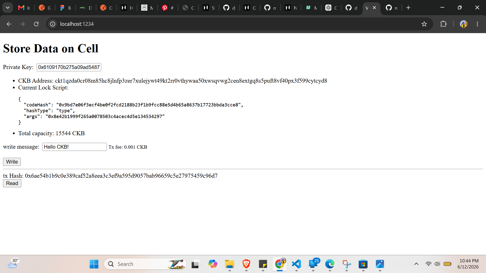
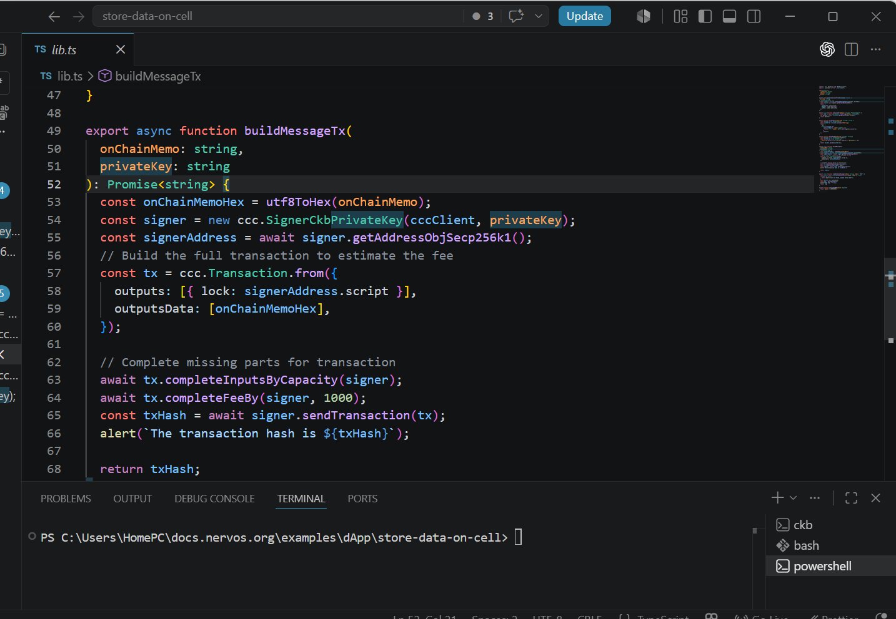
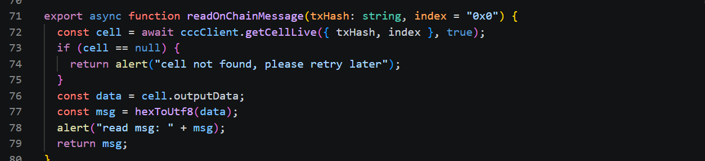
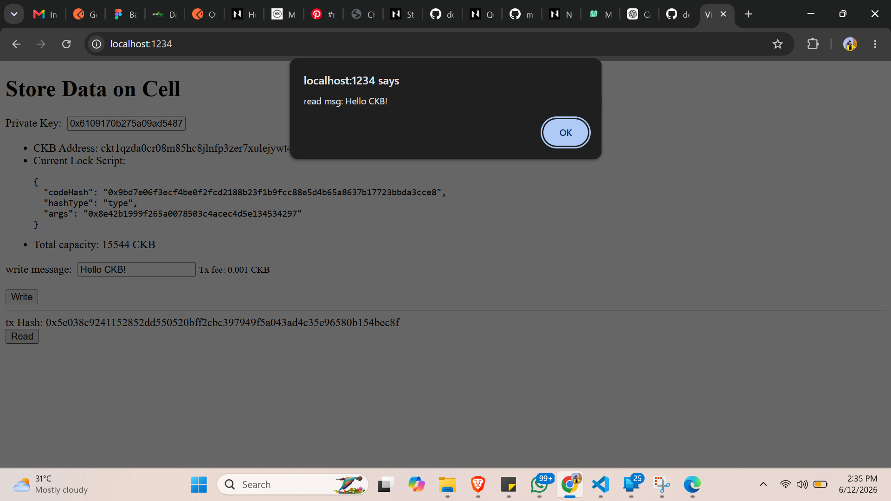
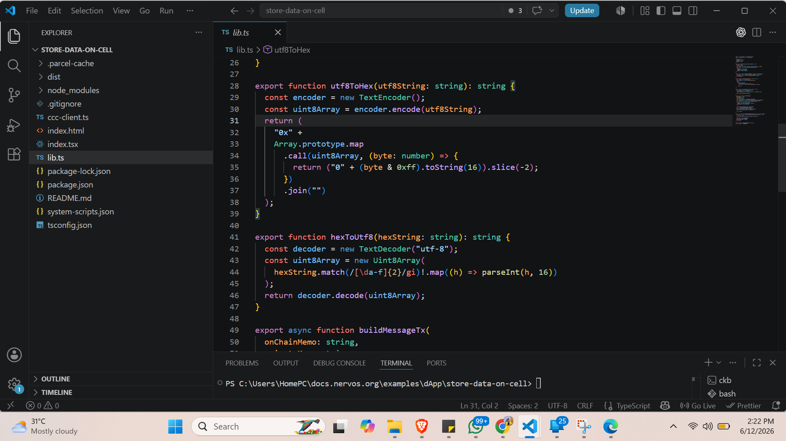

# Store Data on Cell

A React + Vite application for interacting with the CKB (Common Knowledge Base) blockchain to store and retrieve data on cells using the CCC (CKB Chain Common) library.

## Overview

This project provides a user-friendly interface for:
- **Generating accounts** from private keys on CKB networks
- **Building transactions** to store data on cells
- **Reading cell data** and messages from the blockchain
- **Retrieving live cells** for transaction building
- **Encoding and decoding messages** for cell storage
- **Supporting multiple networks**: devnet, testnet, and mainnet

## Table of Contents

- [Prerequisites](#prerequisites)
- [Installation](#installation)
- [Project Structure](#project-structure)
- [Usage](#usage)
- [Available Scripts](#available-scripts)
- [Features](#features)
- [Screenshots](#screenshots)
- [Configuration](#configuration)
- [Development](#development)

## Prerequisites

- **Node.js** (v16 or higher)
- **npm** or **yarn** package manager
- CKB network access (devnet, testnet, or mainnet)
- Private key for account generation

## Installation

1. **Clone the repository:**
```bash
git clone <repository-url>
cd store_data_on_cell
```

2. **Install dependencies:**
```bash
npm install
```

3. **Configure your network:**
Set the `NETWORK` environment variable to choose between `devnet`, `testnet`, or `mainnet`:
```bash
export NETWORK=testnet  # or devnet/mainnet
```

## Project Structure

```
store_data_on_cell/
├── src/
│   ├── App.jsx           # Main React component
│   ├── main.jsx          # Entry point
│   ├── App.css           # Application styles
│   ├── index.css         # Global styles
│   └── assets/           # Static assets
├── ccc-client.ts         # CKB CCC client configuration
├── lib.ts                # Core functions for account generation
├── vite.config.js        # Vite configuration
├── tsconfig.json         # TypeScript configuration
├── package.json          # Project dependencies
├── system-scripts.json   # CKB system scripts configuration
└── eslint.config.js      # ESLint configuration
```

## Usage

### Generate Account from Private Key

```typescript
import { generateAccountFromPrivateKey } from './lib';

const account = await generateAccountFromPrivateKey('your-private-key');
// Returns: { lockScript, address, pubKey }
```

### Build CCC Client

```typescript
import { buildCccClient, readEnvNetwork } from './ccc-client';

const network = readEnvNetwork(); // Reads NETWORK env var
const client = buildCccClient(network);
```

### Supported Networks

- **devnet**: Local development network (via offckb)
- **testnet**: CKB public testnet
- **mainnet**: CKB main network

## Available Scripts

```bash
# Start development server
npm run dev

# Build for production
npm run build

# Preview production build
npm run preview

# Lint code
npm run lint
```

## Features

### 1. Account Generation
Generate CKB accounts using private keys with support for multiple signing algorithms:
- Secp256k1 Blake160 (Single sig & Multisig)
- AnyoneCan Pay
- OmniLock
- xUDT
- Nervos DAO

### 2. Transaction Building
Build and send transactions to store arbitrary data on CKB cells.

### 3. Cell Data Retrieval
Query and retrieve live cells from the blockchain for transaction inputs.

### 4. Message Encoding/Decoding
Encode and decode messages for storage on cells.

### 5. Multi-Network Support
Seamlessly switch between devnet, testnet, and mainnet environments.

## Screenshots

### Running offckb (Local Development Network)


### offckb Account Setup


### Running localhost


### Building Transactions


### Retrieving Live Cells


### Reading Cell Messages


### Encoding and Decoding Messages


## Configuration

### Environment Variables

- `NETWORK`: Specify the CKB network (`devnet` | `testnet` | `mainnet`)
  - Default: `testnet`

### System Scripts

The `system-scripts.json` file contains configuration for CKB system scripts:
- Secp256k1 Blake160 (single sig)
- Secp256k1 Blake160 (multisig)
- Anyone Can Pay
- OmniLock
- xUDT
- Nervos DAO

## Development

### Technology Stack

- **Frontend**: React 19.2.6 with Vite
- **Blockchain Library**: @ckb-ccc/core
- **Language**: TypeScript/JavaScript
- **Build Tool**: Vite
- **Linting**: ESLint

### Development Server

Run the development server with hot module reloading:
```bash
npm run dev
```

The application will be available at `http://localhost:5173`

### Build for Production

```bash
npm run build
```

This creates an optimized production build in the `dist/` directory.

## Dependencies

### Production
- `@ckb-ccc/core` - CKB CCC library for blockchain interactions
- `react` - UI library
- `react-dom` - React DOM rendering

### Development
- `@types/node` - Node.js type definitions
- `@types/react` - React type definitions
- `@types/react-dom` - React DOM type definitions
- `@vitejs/plugin-react` - Vite React plugin
- `vite` - Build tool and dev server
- `eslint` - Code linting

## Security Notes

⚠️ **Important**: 
- Never commit private keys to version control
- Use environment variables for sensitive data
- Validate all user inputs before transaction submission
- Test thoroughly on testnet before using mainnet

## Contributing

1. Create a feature branch
2. Make your changes
3. Run `npm run lint` to ensure code quality
4. Submit a pull request

## License

This project is provided as-is for blockchain development and experimentation.

## Support

For issues and questions:
- Check CKB documentation at https://docs.nervos.org/
- Refer to CCC library: https://github.com/ckb-ccc/ccc
- Review CKB development tools at https://github.com/rethereum-blockchain/offckb

## Resources

- [CKB Documentation](https://docs.nervos.org/)
- [CCC Library GitHub](https://github.com/ckb-ccc/ccc)
- [offckb Development Tool](https://github.com/rethereum-blockchain/offckb)
- [Vite Documentation](https://vite.dev/)
- [React Documentation](https://react.dev/)
